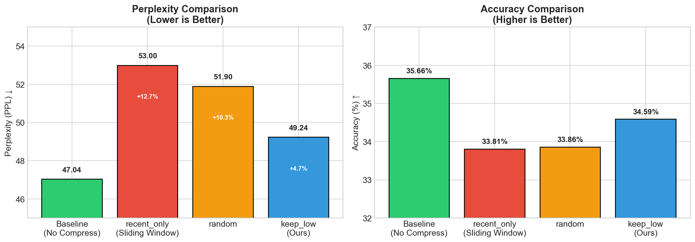
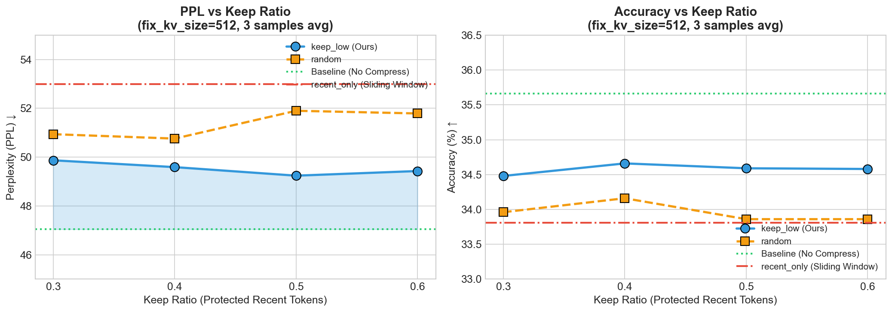

# CS2602 LLM Inference Acceleration

CS2602大作业：针对大型语言模型的KV Cache优化与推理加速。

本项目实现了两种 KV Cache 压缩方法：

1. **KnormPress** (L2 Norm-Based Ratio Compression) - 按比例压缩
2. **Fix-Size KnormPress** (Fixed-Size KV Cache with Eviction) - 固定大小压缩

## 项目概述

KnormPress 是一种基于 L2 范数的 KV Cache 压缩方法。核心思想是：**键嵌入（key embeddings）的 L2 范数较低的 token 通常与较高的注意力分数相关**。通过选择性地保留这些重要的低范数 token，可以在保持模型性能的同时显著减少内存占用和加速推理。

### 两种压缩方法对比

| 方法 | 说明 | 适用场景 |
|------|------|----------|
| `l2_compress` | 按 `keep_ratio` 比例压缩整个 KV Cache | 通用压缩 |
| `fix_size_l2_compress` | 维持固定 KV Cache 大小，超出部分驱逐 | 内存受限场景 |

### 相较于原论文的改进

我们的实现在原始 KnormPress 基础上进行了两项关键改进：

| 改进 | 原论文 | 我们的方法 | 效果 |
|------|--------|-----------|------|
| **Token 排序** | 按 L2 范数排列 | 保持原始时序顺序 | PPL ↓2-5% |
| **混合保留** | 纯 L2 选择 | L2选择 + 保留最近tokens | Acc ↑1-2% |

详细分析请参考：[docs/L2_COMPRESS_ANALYSIS.md](docs/L2_COMPRESS_ANALYSIS.md)

## 项目结构

```
.
├── README.md                    # 项目说明文档
├── LICENSE                      # 许可证
│
├── docs/                        # 文档
│   ├── lab-instruction.md       # 作业要求
│   ├── KnormPress.pdf           # 原始论文
│   └── L2_COMPRESS_ANALYSIS.md  # 压缩效果分析 ⭐
│
├── data/                        # 数据集
│   └── pg19.parquet             # PG-19 长文本数据集
│
├── knormpress/                  # 核心压缩模块 ⭐
│   ├── __init__.py              # 模块导出
│   ├── compress.py              # 压缩函数 (l2_compress, fix_size_l2_compress)
│   ├── evaluate.py              # PPL/Accuracy 评估
│   └── benchmark.py             # TTFT/TPOT 性能基准
│
├── scripts/                     # 工具脚本
│   └── plot_compression_results.py  # 可视化绘图
│
├── baseline_test.py             # 基线性能测试
├── benchmark_knormpress.py      # KnormPress 比例压缩基准测试
├── benchmark_fix_size.py        # 固定大小压缩基准测试
│
├── results/                     # 结果图表
│   ├── strategy_comparison.png
│   ├── keep_ratio_analysis.png
│   ├── ppl_accuracy_tradeoff.png
│   └── improvement_summary.png
│
└── l2compress/                  # 原始论文参考实现
```

## 环境配置

### 依赖安装

```bash
# 创建并激活 conda 环境
conda create -n nlp python=3.13
conda activate nlp

# 安装依赖
pip install torch transformers datasets numpy tqdm
```

### 模型和数据集

- **模型**: `EleutherAI/pythia-70m-deduped`
- **数据集**: `PG-19` (长文本), `wikitext-2-raw-v1` (短文本)

## 使用方法

### 1. 运行基线测试

```bash
conda activate nlp
python baseline_test.py
```

### 2. KnormPress 比例压缩测试

```bash
# 测试不同压缩比率
python benchmark_knormpress.py --keep_ratios 1.0,0.8,0.5,0.3 --num_samples 2

# 自定义参数
python benchmark_knormpress.py \
    --keep_ratios 0.9,0.8,0.7 \
    --prune_after 100 \
    --max_tokens 1500
```

**参数说明**:
- `--keep_ratios`: 压缩比率列表（1.0 = 无压缩，0.8 = 保留 80%）
- `--prune_after`: 缓存超过此大小才压缩
- `--max_tokens`: 评估的最大 token 数

### 3. 固定大小 KV Cache 压缩测试

```bash
# 测试不同固定大小和驱逐策略
python benchmark_fix_size.py --fix_kv_sizes 256,512 --strategies keep_low,keep_high,random

# 自定义参数
python benchmark_fix_size.py \
    --fix_kv_sizes 256,512,1024 \
    --strategies keep_low,random \
    --keep_ratio 0.2 \
    --max_tokens 2000

python benchmark_fix_size.py \
    --fix_kv_sizes 512 \
    --strategies keep_low \
    --keep_ratios 0.1,0.2,0.3 \
    --no_baseline --no_recent_only

```

**参数说明**:
- `--fix_kv_sizes`: 固定 KV Cache 大小列表
- `--strategies`: 驱逐策略列表
  - `keep_low`: 保留低 L2 范数 token（最重要）
  - `keep_high`: 保留高 L2 范数 token
  - `random`: 随机驱逐
- `--keep_ratio`: 保护的最近 token 比例（不会被驱逐），支持列表
- `--no_baseline` : 不开启non-compress benchmark
- `--no_recent_only`: 不开启recent-only compress benchmark

### 4. 在代码中使用

```python
from knormpress import l2_compress, fix_size_l2_compress, evaluate_with_compression

# 方法1: 比例压缩
compressed_kv = l2_compress(
    past_key_values,
    keep_ratio=0.8,      # 保留 80%
    prune_after=1000,    # 超过 1000 token 才压缩
    skip_layers=[0, 1]   # 跳过前两层
)

# 方法2: 固定大小压缩
compressed_kv = fix_size_l2_compress(
    past_key_values,
    fix_kv_size=512,       # 最多保留 512 token
    keep_ratio=0.2,        # 最近 20% 不驱逐
    strategy="keep_low",   # 保留低范数 token
    skip_layers=[0, 1]
)

# 评估 PPL 和 Accuracy
results = evaluate_with_compression(
    model, tokenizer, text,
    keep_ratio=0.8,
    prune_after=100
)
print(f"PPL: {results['perplexity']:.2f}, Acc: {results['accuracy']:.2%}")
```

## 核心算法

### l2_compress (比例压缩)

```
输入: KV Cache (seq_len tokens), keep_ratio
输出: 压缩后的 KV Cache (seq_len * keep_ratio tokens)

1. 计算每个 token 的 L2 范数
2. 按范数升序排序
3. 保留前 keep_ratio 比例的低范数 token
4. 恢复时间顺序
```

### fix_size_l2_compress (固定大小)

```
输入: KV Cache, fix_kv_size, keep_ratio
输出: 最多 fix_kv_size tokens 的 KV Cache

1. 如果 seq_len <= fix_kv_size，不压缩
2. 计算保护区大小: protected = fix_kv_size * keep_ratio
3. 驱逐区 = 前 (seq_len - protected) 个 token
4. 从驱逐区选择 (fix_kv_size - protected) 个 token 保留
5. 合并: 保留的驱逐区 token + 保护区 token
```

## 实验结果

### 固定大小压缩策略对比（fix_kv_size=512）

| 策略 | PPL | Accuracy | PPL 变化 | Acc 变化 |
|------|-----|----------|----------|----------|
| **Baseline** (无压缩) | 47.04 | 35.66% | - | - |
| recent_only (滑动窗口) | 53.00 | 33.81% | +12.7% | -5.2% |
| random | 51.90 | 33.86% | +10.3% | -5.0% |
| **keep_low (推荐)** | **49.24** | **34.59%** | **+4.7%** | **-3.0%** |

### Keep Ratio 影响分析

| Keep Ratio | keep_low PPL | random PPL | 最佳选择 |
|------------|--------------|------------|----------|
| 0.3 | 49.87 | 50.94 | keep_low |
| 0.4 | **49.59** | 50.76 | keep_low |
| 0.5 | **49.24** | 51.90 | keep_low |
| 0.6 | 49.43 | 51.79 | keep_low |

**推荐配置**：`keep_ratio=0.4-0.5`，此区间 `keep_low` 策略表现最优。

### 可视化结果

运行绘图脚本生成可视化图表：
```bash
python scripts/plot_compression_results.py
```




## 参考文献

- **论文**: [A Simple and Effective L2 Norm-Based Strategy for KV Cache Compression](https://arxiv.org/abs/2406.11430) (EMNLP 2024)
- **原始实现**: [l2compress GitHub Repository](https://github.com/NVIDIA/kvpress)
- **Pythia 模型**: [EleutherAI/pythia-70m-deduped](https://huggingface.co/EleutherAI/pythia-70m-deduped)

## 总结

本项目实现了两种 KV Cache 压缩方法：

✅ **l2_compress**: 按比例压缩，适合通用场景  
✅ **fix_size_l2_compress**: 固定大小，适合内存受限场景  
✅ **多种驱逐策略**: keep_low, keep_high, random  
✅ **完整评估**: TTFT, TPOT, PPL, Accuracy  
✅ **模块化设计**: 易于集成到现有代码

## 作者

Jiamin Liu

## 致谢

感谢 KnormPress 论文作者提供的开源实现和详细文档。
