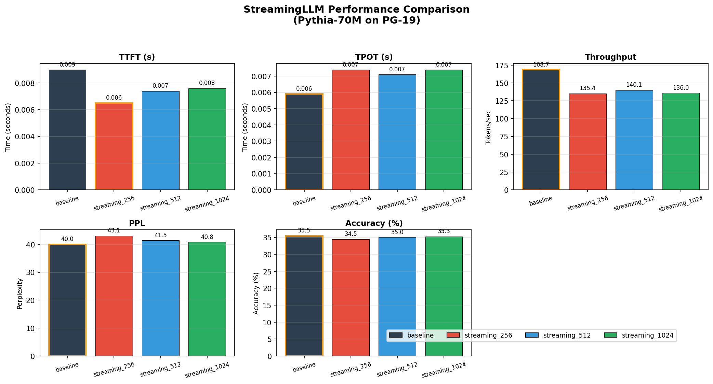
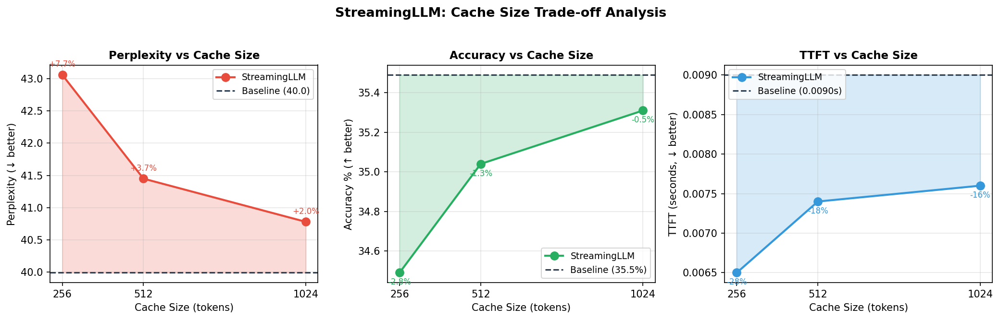
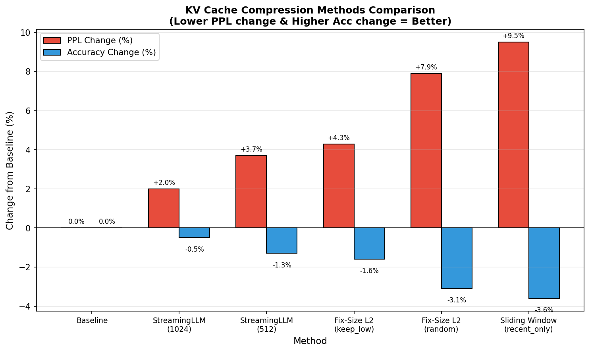

# StreamingLLM 性能分析报告

## 1. 方法概述

StreamingLLM 是 MIT Han Lab 提出的一种 KV Cache 压缩方法（ICLR 2024），核心思想是：

- **Attention Sink 现象**：LLM 会将大量 attention 分配给序列开头的 tokens（"attention sinks"），即使这些 tokens 语义上不重要
- **保留策略**：保留 initial tokens（attention sinks）+ 最近的 tokens（sliding window）
- **无需微调**：不需要额外训练，可直接应用于预训练模型

### Cache 结构

```
[initial tokens (0:start_size)] + [recent tokens (seq_len-recent_size:seq_len)]
```

默认配置：`start_size=4`（4 个 attention sink tokens）

## 2. 实验设置

### 模型与数据集
- **模型**: `EleutherAI/pythia-70m-deduped`（70M 参数）
- **数据集**: PG-19（长文本数据集）
- **样本数**: 10 个样本
- **评估 tokens**: 2024 tokens

### 测试配置
| 配置名称 | start_size | recent_size | 总 Cache 大小 |
|----------|------------|-------------|---------------|
| baseline | - | - | 无限制 |
| streaming_256 | 4 | 252 | 256 |
| streaming_512 | 4 | 508 | 512 |
| streaming_1024 | 4 | 1020 | 1024 |

## 3. 实验结果

### 3.1 主要指标对比

| Method | TTFT (s) | TPOT (s) | Throughput | PPL | Accuracy |
|--------|----------|----------|------------|-----|----------|
| **baseline** | 0.0090 | 0.0059 | 168.71 | 39.99 | 35.49% |
| streaming_256 | 0.0065 | 0.0074 | 135.37 | 43.06 | 34.49% |
| streaming_512 | 0.0074 | 0.0071 | 140.05 | 41.45 | 35.04% |
| streaming_1024 | 0.0076 | 0.0074 | 136.03 | 40.78 | 35.31% |

### 3.2 相对于 Baseline 的变化

| Method | TTFT 变化 | PPL 变化 | Accuracy 变化 |
|--------|-----------|----------|---------------|
| streaming_256 | **-27.8%** ✓ | +7.7% | -2.8% |
| streaming_512 | **-17.8%** ✓ | +3.7% | -1.3% |
| streaming_1024 | **-15.6%** ✓ | +2.0% | -0.5% |

> 注：TTFT 负值表示速度提升（更快），PPL/Acc 正/负值表示变差/变好

### 3.3 关键发现

#### ✅ 优点

1. **TTFT 显著提升**：首 token 生成时间减少 15-28%
   - 原因：固定大小的 KV Cache 减少了内存管理开销
   
2. **PPL 影响可控**：Cache 越大，PPL 损失越小
   - streaming_1024 的 PPL 仅增加 2.0%，几乎无影响

3. **Accuracy 损失轻微**：
   - streaming_1024 的 Accuracy 仅下降 0.5%

#### ⚠️ 注意事项

1. **Throughput 下降**：吞吐量从 168.71 降至 135-140 tokens/sec
   - 原因：每步都需要进行 KV Cache 压缩操作
   - 这在 Pythia-70M 这种小模型上表现明显

2. **权衡关系**：
   - Cache 越小 → TTFT 越好，但 PPL/Acc 越差
   - Cache 越大 → PPL/Acc 越好，但 TTFT 提升越小

## 4. 与其他方法对比

基于同项目的 Fix-Size L2 压缩方法的实验结果（参见 `results.txt`）：

| Method | PPL 变化 | Accuracy 变化 | 特点 |
|--------|----------|---------------|------|
| **StreamingLLM (1024)** | +2.0% | -0.5% | 简单高效，无需计算 |
| Fix-Size L2 (keep_low) | +4.3% | -1.6% | 需要计算 L2 范数 |
| Fix-Size L2 (random) | +7.9% | -3.1% | 随机驱逐 |
| recent_only (滑动窗口) | +9.5% | -3.6% | 最简单但效果最差 |

**结论**：StreamingLLM 在相同 Cache 大小限制下，PPL 损失更小，说明 attention sink 的保留确实有效。

## 5. 可视化

运行以下命令生成可视化图表：

```bash
python scripts/plot_streamingllm_results.py
```

### 5.1 各指标对比



### 5.2 Cache Size 权衡分析



### 5.3 与其他方法对比



## 6. 推荐配置

| 应用场景 | 推荐配置 | 理由 |
|----------|----------|------|
| **质量优先** | streaming_1024 | PPL +2%, Acc -0.5%，几乎无损 |
| **速度优先** | streaming_512 | TTFT -18%，PPL +3.7%，较好平衡 |
| **内存受限** | streaming_256 | TTFT -28%，但 PPL +7.7% |

## 7. 补充实验建议

当前实验存在以下局限性，建议补充实验：

### 7.1 长序列测试（重要）
当前测试的序列长度（2024 tokens）与 Cache 大小相近。应该测试更长序列：

```bash
python scripts/benchmark.py --method streaming_llm \
    --max_tokens 8000 \
    --recent_sizes 252,508,1020 \
    --num_samples 5
```

### 7.2 不同 start_size 测试
验证 attention sink 数量的影响：

```bash
# 需要修改脚本支持 --start_sizes 参数
# 测试 start_size = 1, 2, 4, 8
```

### 7.3 内存使用测试
需要测量实际的 GPU/MPS 内存占用变化。

### 7.4 更大模型测试
在更大的模型（如 Pythia-410M）上测试，预期 StreamingLLM 的收益更明显。

## 8. 结论

StreamingLLM 是一种简单有效的 KV Cache 压缩方法：

1. **主要优势**：TTFT 提升 15-28%，PPL 损失可控（1024 cache 仅 +2%）
2. **核心机制**：通过保留 attention sinks 避免了纯滑动窗口方法的崩溃问题
3. **适用场景**：
   - 流式应用（如实时对话）
   - 超长文本处理（4M+ tokens）
   - 内存受限环境

4. **不适用场景**：
   - 需要完整上下文的任务（如长文本摘要）
   - 对吞吐量要求极高的批处理场景

## 参考文献

- Xiao et al., "Efficient Streaming Language Models with Attention Sinks", ICLR 2024
- https://github.com/mit-han-lab/streaming-llm

